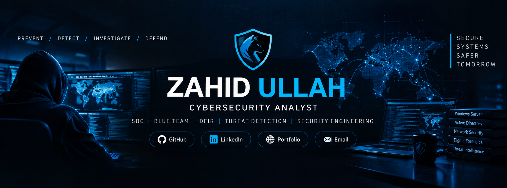

<div align="center">
<div align="center">
  
</div>


<p>
<a href="https://github.com/hckr-zahid"></a>
<a href="https://linkedin.com/in/hckr-zahid"></a>
<a href="https://hckr-zahid.github.io"></a>
<a href="mailto:hckr.badguy@gmail.com"></a>
</p>

</div>

---
<h1 align="center">🧭 SECURITY COMMAND CENTER</h1>


<table>
<tr>
<td width="50%">

### 🎯 Mission

Build, test and document practical cybersecurity capabilities across:

- Threat Detection
- SOC & Blue Team Operations
- Digital Forensics & Incident Response
- Network Security
- Windows Security
- Active Directory Security
- Security Engineering
- Defensive Automation

</td>
<td width="50%">

### 🔐 Security Mindset

```text
UNDERSTAND
     ↓
IDENTIFY
     ↓
DETECT
     ↓
INVESTIGATE
     ↓
RESPOND
     ↓
IMPROVE
```

My focus is not only learning security concepts, but **building working environments and security tools to understand them in practice.**

</td>
</tr>
</table>

---

# 👨‍💻 ABOUT ME

Cybersecurity Analyst with a B.Sc. in Computer Science and a specialized focus on defensive security, threat detection, security engineering, and digital forensics. Comfortable across the complete SOC lifecycle ranging from SIEM monitoring and detection rule engineering to memory/disk forensics and NIST-aligned incident reporting.

Hands-on expertise bridges practical infrastructure labs, Windows security administration, network defense, and custom tool development. Notably, built CyberGun, a modular malware detection platform combining static signature analysis with machine learning-based behavioral detection, alongside Python-driven automation to accelerate triage workflows. Backed by solid foundational training and eight certifications spanning (ISC)2, Google, IBM, Fortinet, and Cisco/NAVTTC, with a strong drive to understand attacker tactics, uncover malicious behaviors, and engineer robust defensive solutions within remote-first teams.

---

# 🛡️ SECURITY SPECIALIZATION


<table width="100%">
  <tr>
    <td align="center" width="20%">
      🛡️<br>
      <b>SOC / BLUE TEAM</b><br>
      <sub>Monitoring &amp; Defense</sub>
    </td>
    <td align="center" width="20%">
      🔎<br>
      <b>THREAT DETECTION</b><br>
      <sub>Detection &amp; Analysis</sub>
    </td>
    <td align="center" width="20%">
      🧪<br>
      <b>DFIR</b><br>
      <sub>Investigation &amp; Response</sub>
    </td>
    <td align="center" width="20%">
      🌐<br>
      <b>NETWORK SECURITY</b><br>
      <sub>Traffic &amp; Infrastructure</sub>
    </td>
    <td align="center" width="20%">
      ⚔️<br>
      <b>OFFENSIVE SECURITY</b><br>
      <sub>Penetration Testing &amp; Exploitation</sub>
    </td>
  </tr>
  <tr>
    <td align="center">
      🖥️<br>
      <b>WINDOWS SECURITY</b><br>
      <sub>Server &amp; Clients</sub>
    </td>
    <td align="center">
      🏢<br>
      <b>ACTIVE DIRECTORY</b><br>
      <sub>Identity &amp; Access</sub>
    </td>
    <td align="center">
      🦠<br>
      <b>MALWARE ANALYSIS</b><br>
      <sub>Suspicious Files</sub>
    </td>
    <td align="center">
      ⚙️<br>
      <b>AUTOMATION</b><br>
      <sub>Security Engineering</sub>
    </td>
    <td align="center">
      🔬<br>
      <b>VULNERABILITY ASSESSMENT</b><br>
      <sub>Scanning &amp; Risk Analysis</sub>
    </td>
  </tr>
</table>


# 🚨 FLAGSHIP SECURITY PROJECT

<div align="center">

# 🛡️ CyberGun

### Advanced Real-Time Threat Mitigation Suite

<a href="https://github.com/hckr-zahid/CyberGun">

</a>

</div>

CyberGun is my primary security-engineering project focused on combining multiple defensive security capabilities into a unified platform.

### 🔬 Detection Engine

| Capability | Purpose |
|---|---|
| 🔐 Hash Analysis | File identification and comparison |
| 🧬 YARA Scanning | Rule-based malware detection |
| 🧱 Byte Signatures | Binary pattern detection |
| 🔤 String Analysis | Suspicious string identification |
| 🤖 Machine Learning | ML-assisted static detection |
| 🧠 Behavioral Analysis | Suspicious behavior monitoring |
| 🌐 Network Analysis | Network threat investigation |
| 🦠 Malware Analysis | Suspicious file analysis |
| 🚨 Ransomware Detection | Detection of ransomware-related behavior |

### ⚡ Defensive Response

```text
THREAT DETECTED
       │
       ▼
┌─────────────────────┐
│ Security Event      │
│ Collection          │
└──────────┬──────────┘
           ▼
┌─────────────────────┐
│ Multi-Layer Analysis│
│ Hash / YARA / ML    │
│ Behavior / Network  │
└──────────┬──────────┘
           ▼
┌─────────────────────┐
│ Threat Assessment   │
└──────────┬──────────┘
           ▼
     ┌─────┴─────┐
     ▼           ▼
  Monitor     Respond
                 │
        ┌────────┴────────┐
        ▼                 ▼
 Process Control      Quarantine
```

### 🌐 Threat Intelligence

CyberGun also incorporates threat-intelligence resources and security databases to support detection and investigation.

**Project:**  
[github.com/hckr-zahid/CyberGun](https://github.com/hckr-zahid/CyberGun)

---

# 🧪 SECURITY LAB

My security lab is designed as a practical environment for understanding enterprise Windows infrastructure, identity, networking and defensive security.

### 🖥️ Windows Infrastructure

- Windows Server 2019
- Active Directory Domain Services
- Domain Controller
- Organizational Units
- User Management
- Security Groups
- Group Policy
- DNS
- DHCP
- File Services
- NTFS Permissions
- Share Permissions
- Windows Client Administration

### 🌐 Network Infrastructure

- VMware Virtual Networking
- LAN Segmentation
- NAT
- Routing
- DNS Infrastructure
- DHCP Infrastructure
- Network Monitoring
- Traffic Analysis
- Network Security

### 🔐 Defensive Security

- Security Monitoring
- Threat Detection
- Event Investigation
- DFIR Workflows
- Active Directory Security
- Windows Security
- Network Security
- Security Automation

---

# 🏗️ SECURITY LAB ARCHITECTURE

```text
                         INTERNET
                            │
                            │
                     ┌──────▼──────┐
                     │   GATEWAY   │
                     │   / NAT     │
                     └──────┬──────┘
                            │
                    INTERNAL SECURITY LAN
                            │
              ┌─────────────┼─────────────┐
              │             │             │
              ▼             ▼             ▼
       ┌────────────┐ ┌────────────┐ ┌────────────┐
       │   DC01     │ │ Windows 10 │ │ Windows 11 │
       │ Windows    │ │   Client   │ │   Client   │
       │ Server 2019│ │            │ │            │
       │ AD / DNS   │ │            │ │            │
       │ DHCP       │ │            │ │            │
       └─────┬──────┘ └────────────┘ └────────────┘
             │
             │
       ┌─────▼──────┐
       │   Domain   │
       │  Services  │
       └─────┬──────┘
             │
      ┌──────┴───────┐
      │              │
      ▼              ▼
  Identity       Policies
  Management     & Security
      │              │
      └──────┬───────┘
             │
             ▼
      SECURITY MONITORING
             │
      ┌──────┴───────┐
      ▼              ▼
 Threat Detection   DFIR
      │              │
      └──────┬───────┘
             ▼
      DEFENSIVE RESPONSE
```

---

# 🏢 ACTIVE DIRECTORY SECURITY LAB

My Windows security environment includes practical Active Directory administration and security work.

### Domain Environment

```text
ZROOTS.LOCAL
│
├── User Accounts
│   └── Staff
│       ├── Staff Users
│       ├── Standard Users
│       └── Test Accounts
│
└── Groups
    └── Security Groups
        ├── Staff
        ├── IT-HelpDesk
        └── Management
```

### Core Areas

- Domain Controller Administration
- User & Group Management
- Organizational Units
- Authentication
- Authorization
- Group Policy
- File Permissions
- Resource Sharing
- Security Boundaries
- Windows Client Domain Integration

---

# 🌐 NETWORK SECURITY LAB

The networking side of the lab focuses on understanding how systems communicate and how defensive monitoring can be applied to network infrastructure.

### Areas of Practice

```text
NETWORK
   │
   ├── TCP/IP
   ├── DNS
   ├── DHCP
   ├── Routing
   ├── NAT
   ├── LAN
   ├── Traffic Monitoring
   ├── Packet Analysis
   └── Network Security
```

### Security Analysis

- Network Traffic
- Suspicious Connections
- IP Analysis
- Process / Connection Mapping
- Packet Inspection
- Network Indicators
- Defensive Monitoring

---

# 🔎 DFIR & THREAT INVESTIGATION

My security work also focuses on the investigation side of cybersecurity.

```text
SECURITY EVENT
      │
      ▼
COLLECT EVIDENCE
      │
      ▼
PRESERVE DATA
      │
      ▼
ANALYZE INDICATORS
      │
      ▼
IDENTIFY BEHAVIOR
      │
      ▼
DETERMINE IMPACT
      │
      ▼
RESPOND
      │
      ▼
DOCUMENT & IMPROVE
```

### Investigation Areas

- Security Events
- Suspicious Files
- Process Activity
- Network Activity
- Indicators of Compromise
- Windows Events
- Threat Intelligence
- Incident Analysis
- Defensive Response

---

# 🧰 SECURITY TECHNOLOGY STACK

### 🖥️ Operating Systems

<p>


</p>

### 🔐 Security

<p>


</p>

### 🏢 Infrastructure

<p>


</p>

### 💻 Development & Automation

<p>


</p>

---

# 🧠 SECURITY ENGINEERING AREAS

| Domain | Practical Focus |
|---|---|
| 🛡️ SOC | Monitoring, analysis and defensive operations |
| 🔎 Detection | Indicators, behavior and suspicious activity |
| 🧪 DFIR | Investigation and incident response |
| 🖥️ Windows | Server and endpoint security |
| 🏢 Active Directory | Identity, access and domain security |
| 🌐 Networking | Infrastructure, traffic and network analysis |
| 🦠 Malware | Static and behavioral analysis |
| 🤖 ML Security | Machine-learning-assisted detection |
| ⚙️ Automation | Security workflows and response |
| 🔐 Engineering | Building practical defensive systems |

---

# 🚀 CURRENTLY BUILDING

### 🛡️ CyberGun

Continuous development of an integrated threat detection and mitigation platform.

### 🏢 Windows Security Lab

Expanding practical Windows Server and Active Directory security capabilities.

### 🌐 Network Security Environment

Building and testing isolated virtual networking environments for security monitoring and analysis.

### 🔎 DFIR Workflows

Developing practical investigation and defensive-response workflows.

### 💻 Cybersecurity Portfolio

Documenting practical projects, infrastructure labs, technical work and security development.

---

# 📚 CONTINUOUS LEARNING

```text
Cybersecurity
     │
     ├── SOC Operations
     ├── Blue Team
     ├── Threat Detection
     ├── Digital Forensics
     ├── Incident Response
     ├── Active Directory Security
     ├── Network Security
     ├── Malware Analysis
     ├── Security Automation
     └── Security Engineering
```

---

# 📊 GITHUB ACTIVITY

<div align="center">


</div>

---

# ⭐ FEATURED WORK

<div align="center">

<a href="https://github.com/hckr-zahid/CyberGun">

</a>

<a href="https://github.com/hckr-zahid/hckr-zahid.github.io">

</a>

</div>

---

# 🌐 PORTFOLIO

My cybersecurity portfolio documents my practical work, projects, labs and technical development.

<div align="center">

<a href="https://hckr-zahid.github.io">

</a>

</div>

---

# 🧭 SECURITY PHILOSOPHY

<div align="center">

### **Learn the Technology.**
### **Understand the Threat.**
### **Detect the Behavior.**
### **Investigate the Evidence.**
### **Build the Defense.**

</div>

I believe cybersecurity becomes stronger when theoretical knowledge is combined with practical experimentation.

My approach is to **build the environment, configure the technology, generate realistic security scenarios, observe the behavior, investigate the evidence and improve the defense.**

---

# 🤝 CONNECT WITH ME

<div align="center">

<a href="https://github.com/hckr-zahid">

</a>

<a href="https://linkedin.com/in/hckr-zahid">

</a>

<a href="https://hckr-zahid.github.io">

</a>

<a href="mailto:hckr.badguy@gmail.com">

</a>

</div>

---

<div align="center">

## 🛡️ SECURITY • DETECTION • INVESTIGATION • DEFENSE

### Built with curiosity. Tested in the lab. Focused on defense.

</div>

